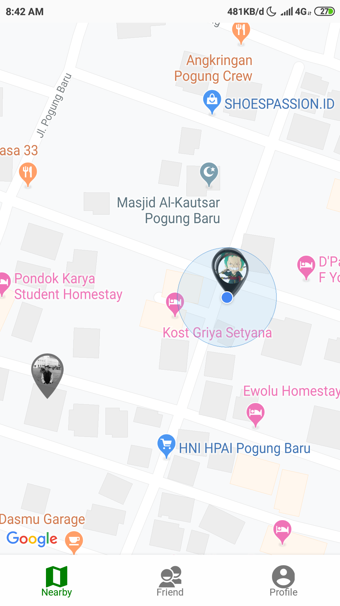

<h1 align="center">Chatify</h1>

  

  Built with React Native.

## Table of Contents

- [Introduction](#introduction)
- [Features](#features)
- [Requirements](#requirements)
- [Usage](#usage-for-development)
- [Screenshots](#screenshots)
- [Release APK](#release-apk)
- [Contributors](#contributors)

## Introduction
Chatify is a simple chat application, Everyone can use it easily. in this Chatify the user can also see the position of the other person in the chat. There is a Firend List feature that we can use to see how many friends we have.

## Features
* People can send to othe people
* there is a map to find out the position of our chat opponent
* friend list
* And others

## Requirements
* [`npm`](https://www.npmjs.com/get-npm)
* [`react-native`](https://facebook.github.io/react-native/docs/getting-started)
* [`react-native-cli`](https://facebook.github.io/react-native/docs/getting-started)
* [`Firebase Console`](https://console.firebase.google.com)

## Usage For Development
1. Open your terminal
2. Copy and Paste here `git clone https://github.com/abdillahtop/Android-Chatify.git`
3. cd `Android-Chatify` type `npm install` for install dependencies and `react-native link`
4. type `react-native run-android` fork run aplikasi. ***Make sure your device is connected with debugging mode***.

## Screenshots

        
    
    

## Release APK

## Contributors

  <table>
    <tr>
      <td align="center">
        <a href="https://github.com/abdillahtop">
           
          <b>Abdillah Dzulfikar Mustanir</b>
        </a>
      </td>
    </tr>
  </table>

